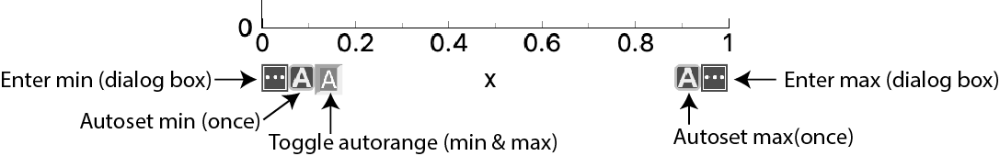
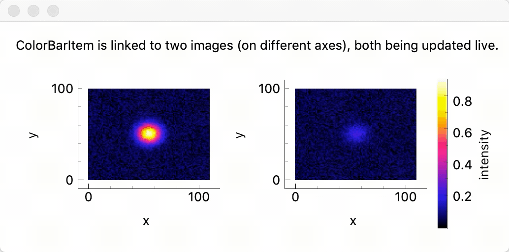

# README

Various extensions for [pyqtgraph](https://github.com/pyqtgraph/pyqtgraph).

Installing `pyqtgraph_extensions` creates two namespaces:

* `pyqtgraph_extensions` - various classes and functions providing some of extra functionality for pyqtgraph
* `pyqtgraph_extended` - a namespace merging pyqtgraph_extensions with the original pyqtgraph

In principle, it should be possible to import `pyqtgraph_extended` instead of `pyqtgraph` and have the same behaviour but with new functionality available. So the two options for using this repository are:

    import pyqtgraph as pg
    import pyqtgraph_extensions as pgx

or

    import pyqtgraph_extended as pg

## Installation

To get latest release from PyPi: `pip install pyqtgraph_extensions`.

Or install from GitHub: `pip install git+https://github.com/draustin/pyqtgraph_extensions`.

pyqtgraph_extensions is packaged using [Poetry](https://python-poetry.org/).

Python 3.6 or later is required.

## Features

See [`pyqtgraph_extensions/examples`](pyqtgraph_extensions/examples) for some examples.

### Axis alignment across multiple plot items

The `AlignedPlotItem` is so-called because it uses its parent's graphics layout object for holding its constituent items (view box, axis items and title) rather than creating one internally. Its constituents can therefore be aligned with those of other items in the parent's graphics layout, including the constituent items of other `AlignedPlotItem` objects. Here's an [example](pyqtgraph_extensions/examples/demo_axis_alignment.py).

### More axis controls

`AxisItem` is reimplemented with its own buttons for autoranging at the upper and lower limits.

### Traditional interactive color bar

`pyqtgraph_extensions` adds a MATLAB-style `ColorBarItem` which can be linked to multiple ImageItems.

### Other

* Simplified exporting with the `export` function
* Easy adding of a second vertical axis on the right hand side (with linked x axis), likewise for a second horizontal axis on the top. See [example](pyqtgraph_extensions/examples/demo_right_top_axes.py).
* More [GLGraphicsItems](http://www.pyqtgraph.org/documentation/3dgraphics/glgraphicsitem.html) - see the [unit tests](pyqtgraph_extensions/opengl/test/test_pyqtgraph_extensions_opengl.py).

## Testing

I use `pytest` with `pytest-qt` during development work and `tox` to test installation & dependencies.

## Plan / outlook

I developed the various features as needed and will continue on the same basis. When I began writing `pyqtgraph_extensions` I was just starting out with Python, Git/GitHub, and open source tools in general (I'm a convert from MATLAB).

I'd be happy for any/all features to be moved into `pyqtgraph` proper. Feel free to [reach out](mailto:dane_austin@fastmail.com.au).

### TODO

* Add switch for user interactivity on color bar example.
* Documentation
